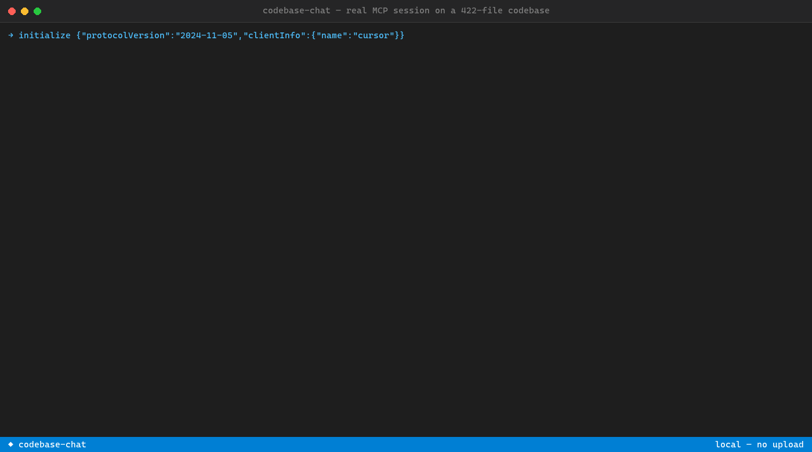
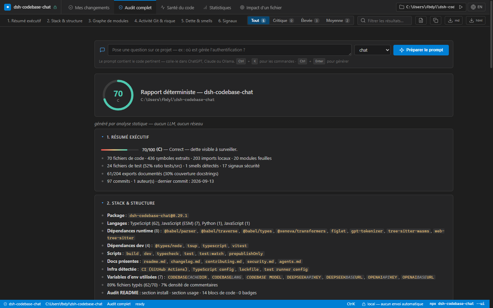
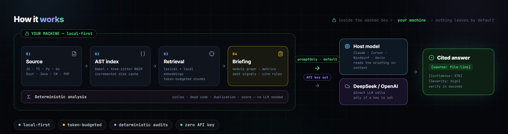

<p align="center">
  <a href="https://shinzarou-eng.github.io/dsh-codebase-chat">
    
  </a>
</p>

<p align="center">
  <a href="https://www.npmjs.com/package/dsh-codebase-chat"></a>
  <a href="https://www.npmjs.com/package/dsh-codebase-chat-mcp"></a>
  <a href="https://github.com/shinzarou-eng/dsh-codebase-chat/blob/main/LICENSE"></a>
  <a href="https://nodejs.org">= 20"></a>
  <a href="https://modelcontextprotocol.io"></a>
</p>

<p align="center">
  <a href="https://shinzarou-eng.github.io/dsh-codebase-chat"><strong>Website</strong></a> ·
  <a href="mcp/README.md">MCP docs</a> ·
  <a href="ROADMAP.md">Roadmap</a> ·
  <a href="CHANGELOG.md">Changelog</a> ·
  <a href="CONTRIBUTING.md">Contributing</a>
</p>

<br>

## Installation

```bash
dsh plugin --profile web add dsh-codebase-chat
```

or as a standalone MCP server / CLI:

```bash
npx dsh-codebase-chat-mcp setup
```

The wizard detects **Claude, Cursor, Windsurf, VS Code, Zed, Gemini CLI, Kiro, Cline and Roo Code**, asks how you want answers (host model or API key), writes the MCP config, done.
No JSON to edit — and **no API key**: in `promptOnly` mode your host model does the thinking,
or get a **fully offline** answer with the deterministic report (`--no-llm`) — no model, no key, no cloud.

Other paths — DeepSeek Harness plugin · CLI · from source · manual config: **[Reference](#reference)**.

<p align="center">
  <br>
  <em>Real MCP session on a real 422-file codebase — <code>codebase_health</code> finds 324 circular deps, <code>codebase_chat</code> answers with <code>[source: file:line]</code> receipts · <a href="docs/assets/demo-power.gif">PR review (--diff + --watch)</a> · <a href="docs/assets/demo.gif">CLI tour</a> · <a href="docs/assets/demo-mcp.gif">MCP stdio</a> · <a href="docs/assets/demo-fr.gif">French mode</a> · <a href="docs/assets/dashboard.png">--ui dashboard</a></em>
</p>

## Local dashboard — `--ui`

```bash
npx dsh-codebase-chat --ui    # → http://127.0.0.1:<port> — no LLM, nothing leaves your machine
```

<p align="center">
  
</p>

One command turns the audit into a real app:

- **IDE-style UI** — editor tabs, dense panels, blue status bar: a tool, not a webpage. Bilingual FR/EN.
- **Command palette** — `Ctrl+K` jumps between views, builds a prompt, exports, toggles zen mode.
- **Zen mode** `z` · view shortcuts `1`–`5` · `/` filters findings by text or severity.
- Check your diff vs baseline, ignore findings, export `.md`/`.html` — all in clicks.

## Usage

_What a real session looks like_ —

Run on this repository — the exact text the tools return:

```console
$ npx dsh-codebase-chat --project . --health

== STATIC ANALYSIS — dsh-codebase-chat ==
Health score: 52/100 (D) · 33 files analyzed · 65 local imports

● Circular dependencies (0)
  none

● Unused files (candidates) (1)
  lib/client.js

● Unused exports (candidates) (45)
  lib/cache.js:21 — cachePath
  lib/index.js:2952 — normalizeLabels
  lib/index.js:2952 — getProjectName
  …

● Duplicate code blocks (2)
  12 lines × 2 files — lib/index.js, src/project.ts
  6 lines × 2 files — src/indexer.ts, src/retriever.ts

● Complexity hotspots (13)
  lib/index.js — score 418
  src/analysis.ts — score 81
  lib/client.js — score 55
  …
```

```console
$ npx dsh-codebase-chat --project . --search "health score computation"

--- src/analysis.ts :: formatHealthReportMd (FUNCTION) [source: src/analysis.ts:285-353] ---
--- src/analysis.ts :: analyzeProject       (FUNCTION) [source: src/analysis.ts:149-232] ---
--- src/analysis.ts :: HealthReport         (TYPE)     [source: src/analysis.ts:15-26]   ---

$ npx dsh-codebase-chat --project . --ask "how is the index cached?"

> dsh-codebase-chat · prompt-only mode (no API key)
> Chunks: 81 · Tokens: 59,934 → handed to the host model
> Cite every technical claim with [source: relative/path:line].
```

`codebase_health` runs fully offline — deterministic, no LLM, same input → same score.
Every answer from `codebase_chat` arrives with `[source: file:line]` receipts you can verify in seconds.

## Verify your changes

```console
$ npx dsh-codebase-chat --baseline        # snapshot findings + score to .codebase-chat/baseline.json (commit it)
$ npx dsh-codebase-chat --check           # impact + findings on files changed vs HEAD, diffed vs the baseline
$ npx dsh-codebase-chat --check --strict  # exit 1 on a red verdict — drop into CI
$ npx dsh-codebase-chat --doctor          # diagnose the install: node, index cache, keys, MCP clients
```

Same thing from an IDE: `/codebase check [ref]` and `/codebase doctor` (MCP tools `codebase_check` / `codebase_doctor`).

## Why it wins

| | Paste into a chat | Hosted assistant | **dsh-codebase-chat** |
| --- | :-: | :-: | :-: |
| Sees your **whole** repo, not one file | ❌ | ✅ | ✅ |
| `[source: file:line]` citations | ❌ | ~ | ✅ |
| Repo never uploaded — model sees only relevant excerpts | ❌ | ❌ | ✅ |
| Inside Claude / Cursor / Windsurf | ❌ | ~ | ✅ |
| Fully offline analysis — `--no-llm` report & `--ui` dashboard, zero model | ❌ | ❌ | ✅ |
| Free — no API key, no account | ~ | ❌ | ✅ |

## How it works

<p align="center">
  
</p>

`/codebase-apply` writes safely — **dry-run** · **`.dsh-backups/`** before overwrite · **protected paths** · never outside the project.

## The 18 tools

| Understand | Decide | Act | Explore |
| --- | --- | --- | --- |
| `codebase_chat` | `codebase_intelligence` | `codebase_refactor` | `codebase_player` |
| `codebase_search` | `codebase_audit` | `codebase_tasks` | `codebase_crea` |
| `codebase_explain` | `codebase_report` | `codebase_fix` | `codebase_doctor` |
| `codebase_health` | `codebase_ceo` | `codebase_ignore` | |
| `codebase_impact` | `codebase_deep_audit` | `codebase_check` | |

Seven tools run **fully deterministic — no model, no key, works offline**: `codebase_health`, `codebase_impact`, `codebase_check` (changes vs a git ref, diffed vs `.codebase-chat/baseline.json`), `codebase_doctor` (install diagnostic), `codebase_ignore` (silence a finding with a justification, committed to `.codebase-chat/ignores.json`), `codebase_fix` (verified mechanical repairs — `dry: true` previews), and `codebase_deep_audit` (9 sections, ~30 metrics: git churn, bus factor, secrets, deps, per-function complexity).

Same engine, three surfaces: **MCP tools** in your IDE, **slash commands** in DeepSeek Harness, **CLI flags** anywhere. Every tool takes `lang` (`fr`/`en`), `embed`, `promptOnly`, `maxTokens`.

## Reference

<details>
<summary><strong>Install — all paths</strong></summary>
<br>

**DeepSeek Harness plugin**

```bash
dsh plugin --profile web add dsh-codebase-chat
```

Then restart `dsh web` → `http://127.0.0.1:3080` → **Codebase Pro** button.

**CLI**

```bash
npx dsh-codebase-chat --project C:\my-app --ask "how is auth handled?"
npx dsh-codebase-chat --project C:\my-app --health   # offline, no LLM
npx dsh-codebase-chat --project C:\my-app --health --diff main   # only what changed
npx dsh-codebase-chat --project C:\my-app --watch    # index stays hot while you code
npx dsh-codebase-chat --project C:\my-app --prompt intelligence   # same banner brief the IDE gets — pipe to any LLM
npx dsh-codebase-chat --project C:\my-app --prompt intelligence --call    # DeepSeek/OpenAI answers directly (API key)
npx dsh-codebase-chat --project C:\my-app --prompt intelligence --no-llm  # deterministic report — zero model, zero key
npx dsh-codebase-chat --project C:\my-app --ui   # interactive HTML dashboard on localhost — no LLM
```

**From source**

```bash
git clone https://github.com/shinzarou-eng/dsh-codebase-chat.git
cd dsh-codebase-chat && pnpm install && pnpm build
```

**Manual MCP config**

```json
{
  "mcpServers": {
    "dsh-codebase-chat": {
      "command": "npx",
      "args": ["dsh-codebase-chat-mcp"]
    }
  }
}
```

Without `DEEPSEEK_API_KEY` / `OPENAI_API_KEY` the server runs `promptOnly`. Set either key for direct-LLM calls — see [`mcp/README.md`](mcp/README.md).

</details>

<details>
<summary><strong>Slash commands (DeepSeek Harness)</strong></summary>
<br>

```powershell
dsh --profile headless '/codebase "how is auth handled?" --project C:\my-app'
dsh --profile headless '/codebase-search "usePetStore" --project C:\my-app'
dsh --profile headless '/codebase-explain "storage.ts" --project C:\my-app'
dsh --profile headless '/codebase-refactor "split this hook" --file storage.ts --project C:\my-app'
dsh --profile headless '/codebase-intel --project C:\my-app'
dsh --profile headless '/codebase-audit --project C:\my-app --lang en'
dsh --profile headless '/codebase-tasks --project C:\my-app'
dsh --profile headless '/codebase-apply-tasks --project C:\my-app'
dsh --profile headless '/codebase-build --project C:\my-app'
dsh --profile headless '/codebase-git --project C:\my-app'
```

</details>

<details>
<summary><strong><code>.codebase-chat.json</code> — per-project settings</strong></summary>
<br>

```json
{
  "lang": "en",
  "maxTokens": 60000,
  "ignoreDirs": ["generated", "fixtures"],
  "ignoreFiles": ["bundle.js"],
  "ignoreGlobs": ["src/vendor/**", "*.snap"],
  "protectedPaths": ["src/locked", "migrations"]
}
```

| Key | Effect |
| --- | --- |
| `lang` | Default prompt language (`en`/`fr`) — CLI, MCP tools, slash commands |
| `maxTokens` | Context budget when the caller passes none |
| `ignoreDirs` / `ignoreFiles` | Extra names skipped by indexing, `codebase_health`, file tree |
| `ignoreGlobs` | Globs on project-relative paths — `**` spans dirs, `*` one segment |
| `protectedPaths` | Paths the apply pipeline can never patch |

</details>

<details>
<summary><strong>Environment variables</strong></summary>
<br>

| Variable | Default | Purpose |
| --- | --- | --- |
| `CODEBASE_CACHE_DIR` | OS cache dir | Where the index cache lives |
| `DSH_PROJECT_ALIASES` | — | Extra `name=path` aliases (`;`-separated) |
| `DSH_PROTECTED_PATHS` | built-in list | Extra paths that can never be patched |
| `DEEPSEEK_API_KEY` / `OPENAI_API_KEY` | — | Direct-LLM mode only |
| `DEEPSEEK_BASE_URL` / `OPENAI_BASE_URL` | `https://api.deepseek.com/v1` | Custom endpoint |
| `CODEBASE_MODEL` | `deepseek-chat` | Model for direct-LLM mode |

</details>

<details>
<summary><strong>Plain words — 🇫🇷 inside</strong></summary>
<br>

Point it at a folder of code. Ask questions like a human — *"How does login work?"*, *"What should I fix first?"* — in French or English. Every answer cites the exact file and line it came from. **Nothing is uploaded anywhere.**

*Pointez-le vers un dossier de code. Posez vos questions en langage clair. Chaque réponse cite le fichier et la ligne exacts. **Rien n'est envoyé sur internet.***

| Term | Meaning |
| --- | --- |
| **MCP server** | A plug format that lets AI assistants use extra tools. Install once — your IDE can "see" your code. |
| **Prompt-only** | The tool prepares the context; your existing AI writes the answer. No extra key, no extra cost. |
| **Deterministic** | Computed directly from your code — same input, same result, every time. |

</details>

<details>
<summary><strong>Project layout & dev</strong></summary>
<br>

```
├── lib/            DeepSeek Harness plugin (index.js) + Codebase Pro UI (client.js)
├── src/            TypeScript engine — indexer, extractor, retriever, tokenizer, context, CLI
├── mcp/            Standalone MCP server package (dsh-codebase-chat-mcp)
├── test/           Vitest suites (extractor, retriever, tasks pipeline)
├── docs/           Landing page (GitHub Pages) + assets
└── dist/           Build output (tsup)
```

```bash
pnpm install && pnpm build && pnpm test && pnpm typecheck
```

</details>

<details>
<summary><strong>FAQ</strong></summary>
<br>

**Does it send my code to the cloud?**
Indexing, retrieval, and prompt building all run on your machine. In prompt-only mode the server makes no network calls itself — the assembled context is read by your host model (cloud or local, your choice). For zero-network output end to end, use `--no-llm`: a deterministic report computed from your code only.

**Do I need an API key?**
No — three ways to get output: the host model (`promptOnly`, best quality — pipe it to a local model like Ollama for offline answers), a DeepSeek/OpenAI key (`--call`), or the deterministic report (`--no-llm`, no model at all). Inside DeepSeek Harness, the plugin uses your configured model.

**Which languages are supported?**
French and English via `lang` on every tool. Source-side, AST covers JS/TS, Python, Go, Rust, Java, C#, PHP — the rest is indexed line by line.

**Is applying patches safe?**
Yes. Dry-run, backups before overwrite, protected paths, writes stay inside the project.

**EADDRINUSE on port 3080?**
```powershell
Get-NetTCPConnection -LocalPort 3080 | ForEach-Object { Stop-Process -Id $_.OwningProcess -Force }
```
Then restart `dsh --profile web`.

</details>

<details>
<summary><strong>Roadmap</strong></summary>
<br>

| | |
| --- | --- |
| **Shipped** | tree-sitter AST (7 languages), deterministic health score + `--no-llm` deep audit, `--ui` local dashboard (IDE-style, Ctrl+K palette, zen mode, bilingual, exports), `codebase_check`/`--fix`/`--ignore`/`--doctor` verified workflow + baseline & CI gate, `codebase_deep_audit` MCP tool + `ui://` resource, token/context stats, MCP setup wizard, `.codebase-chat.json`, `--diff` scoping, `--watch` mode |
| **Next** | GitHub Issues export from TASKS.md, prompt language packs (ES/DE/PT) |
| **Planned** | VS Code extension, HTTP/SSE transport, PR review mode |
| **Exploring** | multi-repo workspaces, shared team index cache, CI bot |

<sub>Full detail: <a href="ROADMAP.md">ROADMAP.md</a></sub>

</details>

---

<p align="center">
  <strong>If this project helps you — <a href="https://github.com/shinzarou-eng/dsh-codebase-chat">star it on GitHub</a> ⭐</strong>
  <br><br>
  <a href="https://shinzarou-eng.github.io/dsh-codebase-chat">Website</a> ·
  <a href="https://github.com/shinzarou-eng/dsh-codebase-chat/issues">Issues</a> ·
  <a href="SUPPORT.md">Support</a> ·
  <a href="SECURITY.md">Security</a>
  <br><br>
  <sub><a href="LICENSE">MIT License</a> — built and maintained by <a href="https://github.com/shinzarou-eng">shinzarou-eng</a></sub>
</p>
